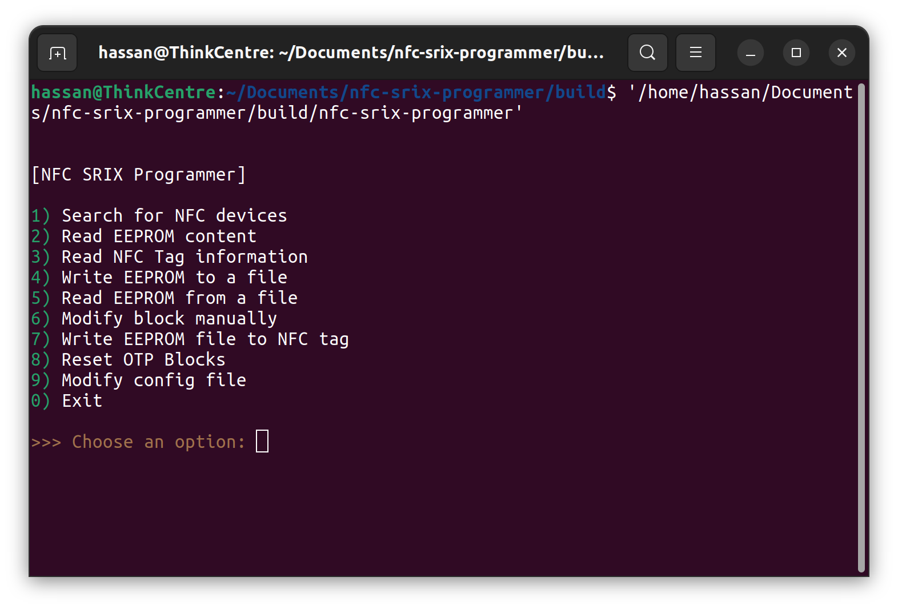
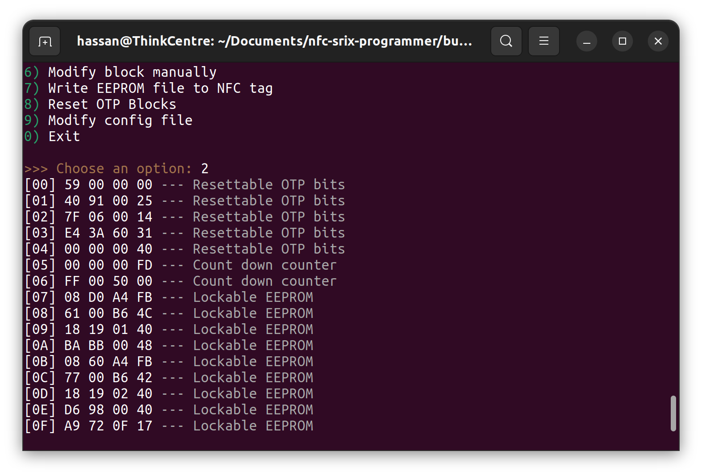
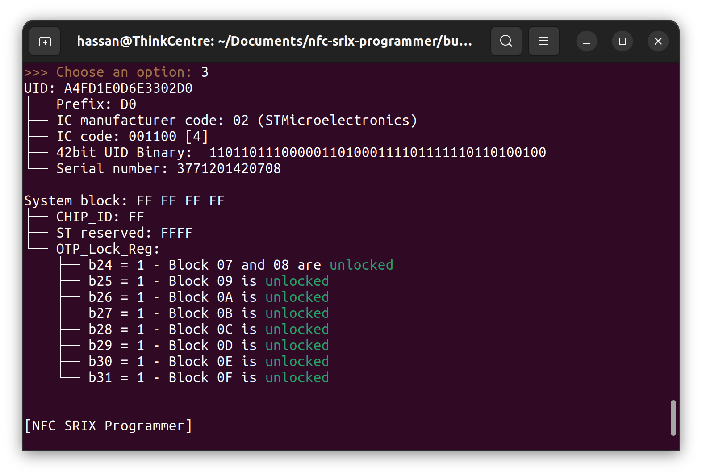

# NFC SRIX Programmer

An CLI NFC application for reading, writing, analyzing, NFC ST SRI512 and SRIX4K tags. 

## Prerequisites

* [libnfc](https://github.com/nfc-tools/libnfc)

## Build

You can use the provided `build.sh` or follow these simple steps:

```bash
mkdir build
cd build
cmake ..
make
```

## Features

* Read EEPROM content
* Read NFC Tag information (such UID, Serial number, System bloks etc...)
* Write EEPROM to a file
* Read EEPROM from a file
* Modify block manually
* Write EEPROM file to NFC tag
* Reset OTP bits

## Screenshots





## Config

```text
Usage: ./nfc-srix [-v] [-y] [-t x4k|512]

Options:
  -v           enable verbose - print debugging data
  -y           nswer YES to all questions
  -t x4k|512   select SRIX4K or SRI512 tag type [default: x4k]
```

## Supported tags

* `SRI512` -  ISO14443B-2 ST SRx Tag IC 13.56MHz with 2 binary counters, 5 OTP blocks and anti-collision with 512-bit EEPROM in 16 Bloks
* `SRIX4` -   ISO14443B-2 ST SRx or ISO14443B-3 ST SRxTag IC 13.56MHz with 2 binary counters, 5 OTP blocks and anti-collision with 4096-bit EEPROM in 128 Blocks

## Note on writing tags!

Compliant ST SRx tags have some blocks that, once changed,cannot be changed back to their original value.Example Counters Blocks 5 and 6. 
Before writing a tag, make sure you're aware of this.

